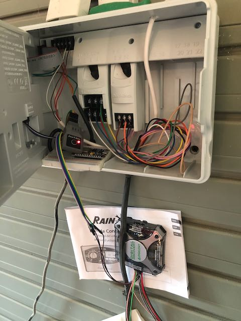

# esp-me_re
Reverse Engineering the remote control protocol on an ESP-ME
The intent of this project is to build a reasonably intelligent remote control to replace the LNK wifi module rainbird provides.  If the remote protocol is more complex than is reasonable to reverse, the faceplate connection will be the next area of research as its output is likely far more simple (most likely just an encoded set of commands to turn on solenoids).  

BOM:
Board P/N: Assy 638321-01
ESPME CPU 19JN15 A-01

PCF2123, 622.103, 14521

HI541, 51K, A9SK

MC9S08LL64CLK, 1N70B, QAR1448K -- this is the main MCU, has LCD controller, Serial, I2C, and SPI interfaces.  
 - https://www.nxp.com/docs/en/data-sheet/MC9S08LL64.pdf
 - Serial is connected to ISP/Debug J3 (6-pin connector without header installed).
 - SPI traces appear to go under the LCD, along with the LCD specific traces from the right side of the MCU.  
 - https://www.nxp.com/docs/en/reference-manual/MC9S08LL64RM.pdf
 
Remote control - J6 on board back, five pin, no ground connection, 1.5vdc on right-most pin (viwing from back of board) with power applied to the board through 9vdc backup battery.  

Old style remote control: RM-1R Remote -- unavailable except from ebay, no reference on rainbird site.
Current style remote: LNK Wifi Module.  Is NOT compatible with this ESP-ME faceplate.  

LNK module:
 - the main chip in this is P/N 450-0163 R3, FCC Id: 0218234 01203 LSR.  Almost certainly this is the wifi chip, but the FCC Database is down so I can't verify this right now. 
 - A secondary MCU (U2) is 441 HD 1BT2
 - Also contains a crystal, 11.059, ABM3C 17F
 - 3630 7182 e3
 - 5 pin connector is marked "ACIN", "MOSI", "GND", "MISO","ACIN"
 - The likely conclusion is that this is a SPI connection based on the signal names -- but the question is where is the CLK signal??  
 - Built a device to mitm the 5 pin connector on the device faceplate that the LNK module uses.  Installed looks like this: 
 

- It's really just a breadboard with two ribbon cables and a set of dupont wires coming out for the logic analyzer.  Microcontroller is not hooked up or powered up for now.  It may be useful later if the communication is in fact SPI in some clockless way.  
- Next project is to record the data that is passed between the module and the faceplate when issuing commands.  One of the biggest problems with the device is that every action taken on the remote application requires the LNK module to establish a connection to the faceplate, get the schedule from the faceplate, do a bunch of extraneous actions before it finally allows the user to issue a command.  Then it goes through another long convoluted process to issue the command.  All I want to do on an application is tell it to turn on station 1, or a list of stations, or whatever else, without going through all these processes and then the new microcontroller can handle whatever magic has to happen behind the scenes and execute whatever command has been sent.  Ideally commands could be sent by text message, email, or directly connecting over the local wireless.  Stretch goal here is to get it integrated with homekit so voice commands can be issued to Siri anywhere to run the water as needed.  

Rain Bird RE Notes:

looks likke the data is all on one wire at 8n0 5.18477232kbaud -- waveforms detects the baud rate correctly.

There is an initial communication, then there is a periodic communication, then each command has its own string.

